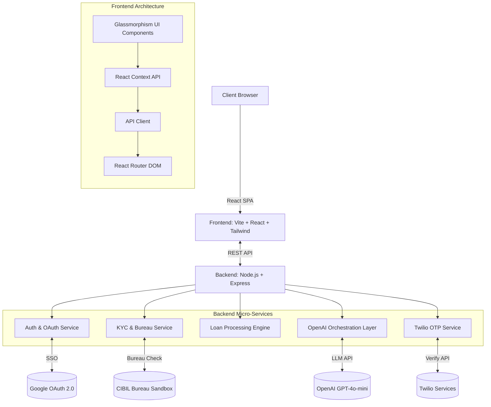

<div align="center">
  
  <h1 align="center">StudyPath AI 🧠</h1>
  <p align="center">
    <strong>The AI Second Brain for Every Indian Student's Study-Abroad & Education Loan Journey</strong>
    <br />
    <i>Built by Team KNV MATES | Poonawalla Fincorp Hackathon 2026</i>
  </p>
</div>

---

## 📖 Overview

StudyPath AI is a comprehensive, end-to-end platform designed to guide Indian students through the complex process of studying abroad and securing an education loan. By integrating AI-powered profile matching, SOP generation, document organization, and a frictionless **Poonawalla Fincorp Loan Bridge**, the platform acts as a digital copilot for students.

## ✨ Key Features

- **🧠 Dream Mapper**: AI builds your Student DNA profile and matches top universities with live admit probability.
- **📅 Journey Copilot**: 12-month personalized action plan with gamified streak tracking.
- **✍️ SOP Studio**: AI generates, reviews, and "roasts" your Statement of Purpose.
- **💰 Smart Loan Bridge**: Seamlessly upload your admit letter to receive a Poonawalla Fincorp loan offer in under 60 seconds with Twilio-verified KYC.
- **🏆 Scholarship Finder**: AI-powered scholarship matching based on individual profiles.
- **✈️ Visa Checklist**: Country-specific visa guides with interactive, dynamic checklists.
- **📁 Document Organizer**: AI-powered document management system with insight extraction.
- **💸 Budget Calculator**: Advanced financial planning with visual breakdowns and real-time currency conversion.
- **🎤 Interview Prep**: University-specific, AI-driven mock interview preparation.

---

## 🏗️ System Design & Architecture

StudyPath AI is built on a modern, decoupled architecture ensuring high performance, scalability, and seamless third-party integrations.

### Architecture Diagram



### Core Technologies
- **Frontend**: React.js, Vite, Tailwind CSS, Framer Motion (for dynamic UI interactions)
- **Backend**: Node.js, Express.js
- **AI Engine**: OpenAI API (GPT-4o-mini)
- **Authentication**: Google OAuth 2.0
- **Communications**: Twilio Verify API (OTP generation and validation)
- **State Management**: React Context API

---

## 🚀 Quick Start

### Prerequisites
- Node.js v18+
- npm or yarn

### Setup Instructions

**1. Clone the repository**
```bash
git clone https://github.com/HEMACHARANREDDY/StudyPathAI.git
cd studypath-ai
```

**2. Setup Backend Environment**
```bash
cd backend
npm install
cp .env.example .env
```
*Configure your `.env` file with the required Twilio, Google OAuth, and OpenAI API keys.*

**3. Start Backend Server**
```bash
npm run dev
```

**4. Setup & Start Frontend**
Open a new terminal window:
```bash
cd studypath-ai/frontend
npm install
npm run dev
```

**5. Open Application**
Navigate to `http://localhost:5173` in your browser.

---

## 📁 Demo Mode

The platform is designed to fall back gracefully if external APIs are not configured:
- **No OpenAI Key?** The system will use intelligent mock data to demonstrate AI generation.
- **Twilio Trial Restrictions?** The backend automatically intercepts unverified number errors and generates a **Local Fallback OTP** displayed directly in the UI for testing.

---

## 👥 Team KNV MATES
- **Karrepu Hema Charan Reddy**
- **Nihar Reddy**
- **Kundam Vishnuvardhan Reddy**
